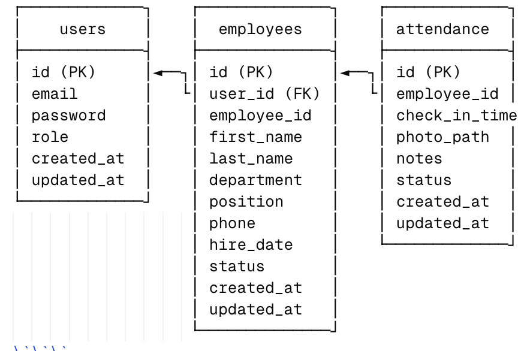

# WFH Attendance Management System

A comprehensive Work From Home (WFH) attendance management system built with a microservices architecture using NestJS for backend services and React for the frontend.

## 🏗️ Architecture Overview

This application follows a microservices architecture with the following components:

- **Auth Service** (Port 3001): Handles user authentication and authorization
- **Employee Service** (Port 3002): Manages employee data and profiles
- **Attendance Service** (Port 3003): Tracks attendance with photo verification
- **Frontend** (Port 3000): React-based user interface
- **MySQL Database** (Port 3306): Centralized data storage

## 📊 Database Schema

### Entity Relationship Diagram

\`\`\`

\`\`\`

### Table Descriptions

#### `users` Table

- **Purpose**: Stores authentication credentials and user roles
- **Key Fields**:
  - `id`: Primary key, auto-increment
  - `email`: Unique email address for login
  - `password`: Bcrypt hashed password
  - `role`: ENUM('employee', 'hr') - determines access permissions

#### `employees` Table

- **Purpose**: Stores detailed employee information
- **Key Fields**:
  - `user_id`: Foreign key linking to users table (nullable)
  - `employee_id`: Unique employee identifier (input from user) (e.g., EMP001)
  - `first_name`, `last_name`: Employee name
  - `department`, `position`: Organizational details
  - `status`: ENUM('active', 'inactive') - employment status

#### `attendance` Table

- **Purpose**: Records daily attendance with photo verification
- **Key Fields**:
  - `employee_id`: Foreign key linking to employees table
  - `check_in_time`: Timestamp of attendance submission
  - `photo_path`: File path to uploaded verification photo
  - `status`: ENUM('present', 'absent', 'late') - attendance status

## 🚀 Quick Start Guide

### Prerequisites

Before starting, ensure you have the following installed:

- **Docker & Docker Compose** (recommended)
- **Node.js** (v18 or higher)
- **MySQL** (v8.0 or higher)
- **Git**

### Option 1: Docker Setup (Recommended)

1. **Clone the repository**
   \`\`\`bash
   git clone `<repository-url>`
   cd wfh-attendance-system
   \`\`\`
2. **Start all services with Docker Compose**
   \`\`\`bash

   docker-compose -f docker-compose.dev.yml up --build
   \`\`\`
3. **Verify services are running**
   \`\`\`bash
   docker-compose ps
   \`\`\`
4. **Access the application**

   - Frontend: http://localhost:3000
   - Auth Service: http://localhost:3001
   - Employee Service: http://localhost:3002
   - Attendance Service: http://localhost:3003

### Option 2: Manual Setup

#### 1. Database Setup

\`\`\`bash

# Start MySQL server

mysql -u root -p

# Create database and user

CREATE DATABASE wfh_attendance;
CREATE USER 'wfh_user'@'localhost' IDENTIFIED BY 'wfh_password';
GRANT ALL PRIVILEGES ON wfh_attendance.* TO 'wfh_user'@'localhost';
FLUSH PRIVILEGES;

# Import initial schema

mysql -u wfh_user -p wfh_attendance < database/init.sql
\`\`\`

#### 2. Backend Services Setup

**Auth Service:**
\`\`\`bash
cd services/auth
npm install
cp .env.example .env  # Configure environment variables
npm run start:dev
\`\`\`

**Employee Service:**
\`\`\`bash
cd services/employee
npm install
cp .env.example .env  # Configure environment variables
npm run start:dev
\`\`\`

**Attendance Service:**
\`\`\`bash
cd services/attendance
npm install
cp .env.example .env  # Configure environment variables
mkdir -p uploads  # Create uploads directory
npm run start:dev
\`\`\`

#### 3. Frontend Setup

\`\`\`bash
cd frontend
npm install
cp .env.example .env  # Configure API endpoints
npm start
\`\`\`

## 🔧 Environment Configuration

### Backend Services (.env)

\`\`\`bash

# Database Configuration

DB_HOST=localhost
DB_PORT=3306
DB_USERNAME=wfh_user
DB_PASSWORD=wfh_password
DB_DATABASE=wfh_attendance

# JWT Configuration

JWT_SECRET=your-super-secret-jwt-key-change-in-production
JWT_EXPIRES_IN=24h

# Service Configuration

NODE_ENV=development
PORT=3001  # Different for each service

# Inter-service Communication

AUTH_SERVICE_URL=http://localhost:3001
EMPLOYEE_SERVICE_URL=http://localhost:3002
ATTENDANCE_SERVICE_URL=http://localhost:3003
\`\`\`

### Frontend (.env)

\`\`\`bash
REACT_APP_AUTH_SERVICE_URL=http://localhost:3001
REACT_APP_EMPLOYEE_SERVICE_URL=http://localhost:3002
REACT_APP_ATTENDANCE_SERVICE_URL=http://localhost:3003
\`\`\`

## 👥 Default User Accounts

The system comes with pre-configured test accounts:

### HR Account

- **Email**: hr@company.com
- **Password**: password123
- **Role**: HR (full access to all features)

### Employee Account

- **Email**: employee@company.com
- **Password**: password123
- **Role**: Employee (limited access)

## 🎯 Features

### For Employees

- ✅ Daily attendance submission with photo verification
- ✅ View personal attendance history
- ✅ Dashboard with attendance statistics
- ✅ Profile management

### For HR Personnel

- ✅ View all employee attendance records
- ✅ Employee management (CRUD operations)
- ✅ Attendance statistics and reporting
- ✅ Photo verification review

## 📱 API Documentation

Complete API documentation is available in [API_DOCUMENTATION.md](./API_DOCUMENTATION.md).

### Quick API Examples

**Login:**
\`\`\`bash
curl -X POST http://localhost:3001/auth/login
  -H "Content-Type: application/json"
  -d '{"email":"employee@company.com","password":"password123"}'
\`\`\`

**Submit Attendance:**
\`\`\`bash
curl -X POST http://localhost:3003/attendance
  -H "Authorization: Bearer YOUR_JWT_TOKEN"
  -F "employeeId=1"
  -F "photo=@/path/to/photo.jpg"
  -F "notes=Working from home today"
\`\`\`

## 🧪 Testing

### API Testing with Postman

1. Import the Postman collection:
   \`\`\`bash

   # Collection file location

   postman/WFH-Attendance-API.postman_collection.json
   \`\`\`
2. Set up environment variables in Postman:

   - `auth_service_url`: http://localhost:3001
   - `employee_service_url`: http://localhost:3002
   - `attendance_service_url`: http://localhost:3003
     \`\`\`
